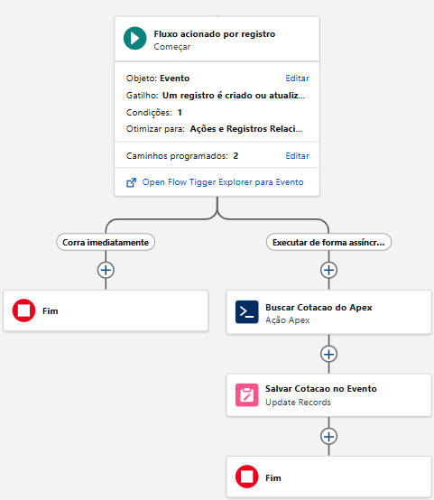
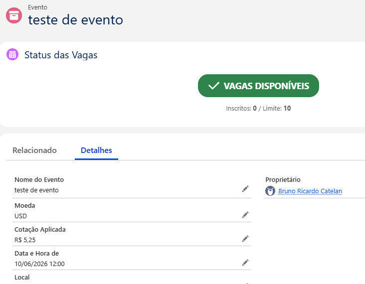

# FinTrack — Integração Financeira Internacional (Módulo EventHub) 🚀

O **FinTrack** é um módulo de automação de arquitetura híbrida desenvolvido para estender as capacidades do ecossistema **EventHub**. Ele atua identificando eventos cadastrados com moedas estrangeiras (como USD, EUR e GBP) e aciona de forma assíncrona um motor Apex Invocable responsável por converter e carimbar o câmbio oficial de forma automatizada.

---

## 🛠️ Tecnologias e Arquitetura Utilizadas

| Camada | Tecnologia | Propósito no FinTrack |
| :--- | :--- | :--- |
| **Gatilho de Entrada** | Record-Triggered Flow (Salesforce) | Captura de eventos em tempo real quando o campo `Moeda__c` é alterado para um valor diferente de `BRL`. |
| **Performance** | Caminho Assíncrono (`Run Asynchronously`) | Execução em segundo plano dissociada do fluxo principal de salvamento, otimizando o tempo de resposta da tela (*UI performance*). |
| **Ponte Declarativa** | Método Invocável (`@InvocableMethod`) | Permite que administradores invoquem lógicas complexas de código Apex diretamente de dentro do Flow Builder. |
| **Lógica Computacional** | Classes Apex Bulkificadas | Processamento de requisições de câmbio estruturado estruturalmente para lidar com inserções de registros em lote. |
| **Padrão de Projeto** | Arquitetura de Mock | Simulação de barramento de integração externa para retorno e alimentação dos valores de câmbio sem dependências rígidas. |

---

## 📐 Fluxo do Processo de Negócio

1. **Evento Gerado:** Um operador cria um Evento definindo a picklist `Moeda__c` como `USD`.
2. **Avaliação do Flow:** O motor declarativo valida se o critério de entrada foi atendido (`Moeda__c != 'BRL'`).
3. **Desacoplamento Assíncrono:** O Salesforce joga a execução para a fila assíncrona, liberando a interface do usuário imediatamente.
4. **Execução Apex:** O método `obterCotacaoMoeda` avalia em lote as moedas enviadas pela coleção do Flow.
5. **Persistência:** O Flow recebe os dados primitivos processados pelo Apex e atualiza o campo de moeda `Cotacao_Aplicada__c`.

---

## 💻 Código Apex Principal

Abaixo está o core da lógica desenvolvida em Apex estruturada para interagir nativamente com o Flow Builder:

```apex
public class FinTrackService {

    // Classe que define a estrutura de entrada (o que o Flow envia para o Apex)
    public class CotacaoRequest {
        @InvocableVariable(label='Código da Moeda (Ex: USD, EUR)' required=true)
        public String codigoMoeda;
    }

    // Classe que define a estrutura de saída (o que o Apex devolve para o Flow)
    public class CotacaoResponse {
        @InvocableVariable(label='Valor da Cotação Convertida')
        public Decimal valorCotacao;
    }

    // O método Invocable que o Flow enxerga e executa de forma assíncrona
    @InvocableMethod(label='FinTrack: Obter Cotação de Moeda' description='Busca a cotação da moeda estrangeira informada no Evento.')
    public static List<CotacaoResponse> obterCotacaoMoeda(List<CotacaoRequest> requests) {
        List<CotacaoResponse> responses = new List<CotacaoResponse>();
        
        // Loop para processar os registros em lote (boas práticas de Bulkificação no Salesforce)
        for (CotacaoRequest req : requests) {
            CotacaoResponse res = new CotacaoResponse();
            
            // Arquitetura de Mock: Simulação dos valores de câmbio
            if (req.codigoMoeda == 'USD') {
                res.valorCotacao = 5.25;
            } else if (req.codigoMoeda == 'EUR') {
                res.valorCotacao = 5.70;
            } else if (req.codigoMoeda == 'GBP') {
                res.valorCotacao = 6.80;
            } else {
                res.valorCotacao = 1.00; // Caso seja BRL ou outra moeda não mapeada
            }
            
            responses.add(res);
        }
        
        return responses;
    }
}
```


---

## 📸 Demonstração do Flow e Resultados

### Configuração do Flow
O fluxo utiliza regras estritas de execução assíncrona, configurado para disparar apenas quando um registro é modificado para atender aos critérios exigidos.



### Resultado Prático
Ao cadastrar um evento em USD, o campo Cotação Aplicada é preenchido automaticamente com o valor de 5,25 através do processo em segundo plano (após atualização do registro).



---

## 🚀 Como Implantar na sua Org

1. Crie o campo Picklist `Moeda__c` (valores: `BRL`, `USD`, `EUR`, `GBP`) no objeto `Evento__c`.
2. Crie o campo Currency (Moeda) `Cotacao_Aplicada__c` no objeto `Evento__c`.
3. Implante a classe Apex `FinTrackService` no ambiente.
4. Crie, configure e ative o `Record-Triggered Flow` vinculando a ação Apex e a atualização dos campos na perna do caminho `Run Asynchronously`.

---
_Módulo integrante do ecossistema **EventHub** desenvolvido por **Bruno Catelan**._